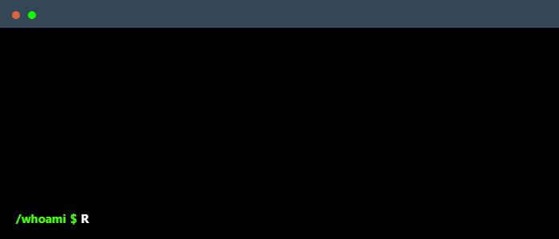

<a href="https://git.io/typing-svg">git 
  
</a>

 

  

 

---

### About me

I'm a self-directed full stack developer focused on building clean, functional web applications. Currently deepening my knowledge in backend architecture, data structures, and algorithms. I enjoy understanding *why* things work, not just *how* to use them.

---

### Main skills

### Currently studying

---

### GitHub stats

  

  &nbsp;&nbsp;

  

 

---

### Connect with me 

---

### Employer?

> [!IMPORTANT]
> <a href="https://drive.google.com/drive/folders/1hJGhQTtzDUzMqRtoIQUx7QTLtCN726ZK?usp=sharing" download>Download my resume</a>

