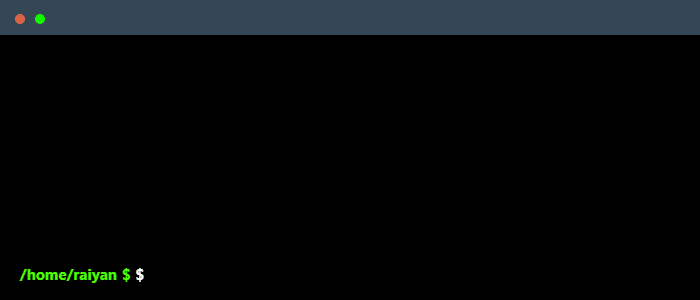

 

  

 

---

### About me

I'm a self-directed full stack developer focused on building clean, functional web applications. Currently deepening my knowledge in backend architecture, data structures, and algorithms. I enjoy understanding _why_ things work, not just _how_ to use them.

---

### Main skills

## 🛠️ Tech Stack

###  Primary Stack

###  Additional Exposure

---

### GitHub stats

&nbsp;&nbsp;

 

---

### Connect with me

---

### Employer?

> [!IMPORTANT]
> <a href="https://drive.google.com/file/d/1QQD5MXqZo7GSqvfsKzw3FMSbha8LhF_2/view?usp=drivesdk" download>Download my resume</a>

